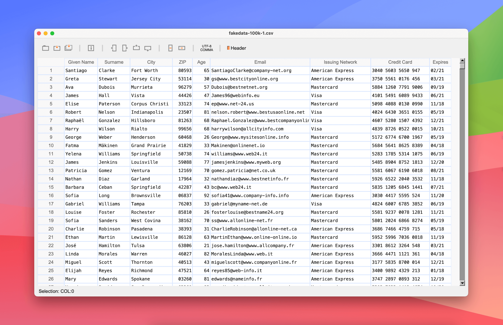

  

**Tablecruncher** is a blazing-fast CSV editor built to handle massive files with ease, already available for macOS, with Windows and Linux coming soon.
Need to open a 2 GB file with 16 million rows? On a Mac Mini M2, Tablecruncher does it in just 32 seconds.

**Originally released in 2017 as a commercial app, Tablecruncher is now free to use and will soon be released as open source under the GPL v3 license.**

---

## 🖼️ Screenshot

---

## 🎯 Key Features

- 🚀 **Opens huge CSV files effortlessly**
- ⚙️ **Built-in JavaScript macro language**
- 🌍 **Supports multiple encodings**: UTF-8, UTF-16LE, UTF-16BE, Latin-1 (ISO-8859-1), and Windows 1252
- 🎨 **Four color themes** to match your style

---

## 🔽 Download

Get the latest official release:  
👉 **[tablecruncher.com/download/](https://tablecruncher.com/download/)**

You’ll also find all previous versions archived there.

---

## 🙌 Want to Support Tablecruncher?

Here’s how you can help:

- ⭐ **Star this repository** — it really helps!
- 📣 **Share it** on LinkedIn, X/Twitter, Mastodon, or your favorite platform
- 🐞 **Test the app and report bugs** via GitHub Issues
- 📰 **Join my newsletter**: [The Missing Header](https://missingheader.com) — a deep dive into data handling challenges and tools

---

## ⚖️ License & Branding

The Tablecruncher application will be licensed under [GPL v3](LICENSE).

You are welcome to fork and build upon Tablecruncher. If you release a modified version, _please use a different name and logo_ to avoid user confusion.
